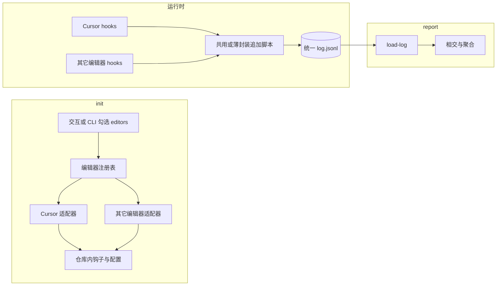

# 多 AI 编辑器接入规划（multi-editor）

本文档描述在 **init 阶段**由用户勾选实际使用的编辑器、在 **运行时**由各编辑器
钩子写入统一日志、在 **report 阶段**复用现有相交逻辑的架构规划。与当前实现
（`.cursor/hooks.json` → `aicode-ratio-append-log.mjs` → 单一 JSONL、
`load-log.ts` 消费 `v:1`）对齐，偏重可演进、尽量不推翻现有报表逻辑。

**现状摘要**：仓库已支持 Cursor Hooks；路线图中的其它编辑器将逐步以「适配器」形
式接入。

---

## 1. 目标与原则

### 1.1 目标

- 在 `init` 阶段让用户选择实际使用的 AI 编辑器（可多选）。
- 各编辑器按其官方或事实上的 hook 入口，在本地记录「改过、保存过哪些文件」。
- `report` 仍基于**同一份或可合并的同构日志**与 Git 做文件级、时间窗交叉。

### 1.2 原则

- **日志模型统一**：所有编辑器最终写入同一套 JSONL 行结构（与
  [aicode-ratio-npm-package.md](./aicode-ratio-npm-package.md) 中「日志格式」一致，
  或无痛升级到 `v:2`），避免为每个编辑器重写相交算法。
- **安装逻辑插件化**：每种编辑器对应一个「适配器」，负责：安装产物路径、
  `hooks.json` 或其它配置的**幂等合并**、`doctor` 检查项。
- **可选归因维度**：行内可增加可选字段（如 `editor: "cursor"`），报表首版可忽略
  以保持比例算法不变；后续可做「按编辑器拆分」且不破坏兼容性。
- **诚实边界**：并非所有产品都具备等价于 Cursor `afterFileEdit` 的稳定钩子；适配器
  需标注 **tier**（官方支持 / 实验 / 文档扩展 / 暂不可用），避免用户勾选后无日志
  却误以为已启用。

---

## 2. 整体架构

- **共用写日志核心**：保留 `pickPath`、`gitTopLevel`、`ignoreLogPathPrefixes` 等逻辑；
  不同编辑器若 stdin JSON 形状不同，在**最外层**做字段映射（或通过 `argv` /
  环境变量传入 `editor`），再写入统一行格式。
- **init**：根据勾选调用各适配器 `install(repoRoot)`；未勾选的编辑器不写入钩子
  （或通过 `uninstall` 语义对齐，避免幽灵条目）。
- **单一日志文件**：默认仍使用配置项 `logPath` 指向的**一个**文件；若未来某编辑器
  要求独立文件，可扩展 `additionalLogStreams`，由 `report` 在 `load-log` 层合并索引
  （第二优先级）。

---

## 3. 配置扩展（`.aicode-ratio.json`）

在现有字段基础上新增（字段名可在实现时再定稿）：

| 字段 | 类型 | 说明 |
| --- | --- | --- |
| `enabledEditors` | `string[]` | 与用户勾选一致，如 `["cursor"]` |
| `editors.<id>.installerRevision`（可选） | `string` / `number` | 安装修订记录，便于升级幂等合并 |

不要求首版即为每个编辑器配置独立 `logPath`；多端默认追加同一 `logPath` 以降低
`report` 复杂度。

---

## 4. Init 交互与非交互入口

兼顾终端用户与脚本/CI：

1. **交互默认**：多选菜单「使用哪些可追踪 **AI 改文件记录** 的编辑器？」每项附 tier 与
   前置条件说明。无 TTY 或 `--yes` 时可退化为默认仅 `cursor` 或文档约定默认集。
2. **非交互**：例如 `aicode-ratio init --editors cursor,windsurf` 或环境变量
   `AICODE_RATIO_EDITORS=cursor`。

行为约定：

- 仅对勾选项执行对应适配器 `install`。
- 用户取消某编辑器时，可选是否移除本包此前写入的该编辑器 hook 条目（与
  `uninstall` 设计对齐）。

---

## 5. 编辑器适配器（内部模块契约）

每个适配器建议实现：

| 职责 | 说明 |
| --- | --- |
| `id` | 稳定 slug，如 `cursor` |
| `label` | 展示名 |
| `tier` | `supported` \| `beta` \| `unsupported` |
| `install(repoRoot, ctx)` | 复制脚本、合并配置、更新 `.gitignore` 中与该编辑器相关的条目 |
| `uninstall` | 移除本包在该编辑器命名空间写入的条目（类似现有 `hooks.json` 命令行 marker 匹配） |
| `doctorChecks` | 校验配置文件、钩子 command、脚本路径可读等 |

当前 **Cursor** 适配器可视为现有 `init` + `mergeHooksJson` 的搬家与参数化。
其它编辑器按各自钩子位置单独实现 `install`，但**写入前**必须把事件归一为统一
JSONL 行。

---

## 6. 日志行 Schema 演进

- **兼容性**：保留 `v:1` 与现有必填字段；`load-log` 忽略未知字段。
- **推荐新增可选字段**：
  - `editor`：字符串，标明日志来源编辑器（报表可选使用）。
  - `event`：继续记录语义事件名；非 Cursor 的 hook 名称应**映射**到现有
    `afterFileEdit` / `afterTabFileEdit`，或等价地映射到 `source: agent \| tab`
    通道；无法区分 Tab/Agent 时，可统一记为 `agent` 并在 README 标明粒度取舍。

可选用已有 `payloadHash` 字段做调试与去重视图；不向日志写入源码或 prompt。

---

## 7. `report` 与 `load-log`

- **首版**：不改变相交算法；多编辑器等价于多条同构日志汇入同一索引。
- **后续**：若需「按编辑器占比」，在聚合阶段按 `editor` 分桶即可；Git 相交仍以
  `path` + 时间窗为准。

---

## 8. `doctor` 扩展

输出建议按编辑器分节：

- Cursor：`hooks.json`、钩子脚本、`logPath` 可写性。
- 其它：由各适配器注册的检查项补齐。

失败时指向本文档或 README 中「该编辑器所需版本 / 权限」说明。

---

## 9. 风险与说明

1. **能力不齐**：勾选某编辑器不代表能获得与 Cursor 同等的粒度；需在 UI 文案与
   README 写明 tier。
2. **多端重复写入**：同一保存若触发多端 hook，时间窗内可能多条记录；对当前「是否
   在窗内有命中」的布尔相交影响通常有限；若未来要按次数归因，再在 schema / 读取层
   引入去重策略。
3. **升级与幂等**：适配器写入需保留可识别的 command marker（与现有
   `HOOK_COMMAND_MARKER`、`LEGACY_HOOK_COMMAND_MARKERS` 思路一致）。

---

## 10. 建议落地顺序

1. 抽出 **CursorAdapter** 与 **注册表**，`init` 行为不变但能写入
   `enabledEditors`。
2. 为 `append-log`（或等价入口）增加 `editor` 传参路径（如额外 `argv`），写入可选
   `editor` 字段；不写时兼容旧日志。
3. 实现交互 / `--editors` 及 `doctor` 分节输出。
4. 按优先级逐个接入第二家及以上「确有稳定 **文件变更钩子**」的编辑器（每接一家做一次端到
   端验收）。

---

## 11. 相关文档

- [aicode-ratio-npm-package.md](./aicode-ratio-npm-package.md) — 整体包设计、日志字
  段表、Hooks 合并策略
- [Cursor Hooks 文档](https://cursor.com/cn/docs/hooks) — 当前首选编辑器钩子约定
